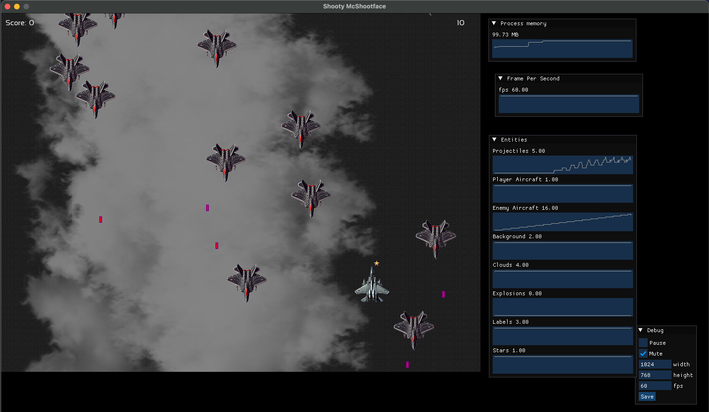

# Shooty McShootface

A vertical shooter built in C++20, using [SFML](https://www.sfml-dev.org) along with the STL, Boost, and rapidcsv for efficient data management and performance. The game includes an Editor Mode, enabling real-time performance monitoring and memory usage tracking, alongside tools for adjusting settings dynamically.

### Game Mode


### Editor Mode



---

## Key Features

### Memory and Performance
- **Memory Management**: A balance of smart and raw pointers is used.
    - **Smart Pointers**: Used in non-critical areas like `Game` and `StateHandler` for clarity.
    - **Raw Pointers**: Leveraged in performance-sensitive parts like the object pool, following RAII principles for manual memory control.
- **Template-Based Object Pool**: Designed a template-based object pool to minimize heap allocations and improve runtime performance.
- **Memory and FPS Graphs**: Utilising a `circular buffer`, these graphs give a high level look at the stats in Editor Mode. 

### Data Management
- **Serialization & Deserialization**:
    - **Rapidcsv Integration**: Simplifies configuration with structured CSV support, enabling both loading and saving of game settings.
    - **Boost::pfr**: Custom layer built on top of rapidcsv to enable struct serialization with templates, removing the need for hardcoded struct/CSV fields.

### Game Architecture
- **Entity Management**:
    - **ECS-Inspired Architecture**: Systems inspired by ECS principles for modular entity handling.
- **State Management**:
    - **StateHandler**: Manages `World` instance lifecycle, ensuring efficient memory usage.
- **Encapsulation (PImpl Idiom)**: Applied in `StateHandler` and `World` for encapsulation, omitted in core game systems to maximize performance.

### Initializers and Entity Spawning
- **Entity Initializers**: Custom initializers streamline entity setup and spawning, maintaining modularity.

### Visuals and Animation
- **Fragment Shaders**:
    - A shader to flash the player aircraft on hit.
    - A shader to distort the clouds for a more natural effect.
- **Visual Effects**:
    - **Parallax Scrolling**: Adds depth to the ground and cloud layers.
- **Sprite Animation**: Frame-based animations using sprite sheets for smooth visuals

### Settings
- **ImGui Debug Menu**: Provides an interactive menu for adjusting game settings during runtime, with changes saved back to the CSV file.

---

# Installation

This game uses CMake for build configuration, and most dependencies are managed automatically using `FetchContent_Declare`, with the exception of Boost:

#### macOS
1. Install Boost using [Homebrew](https://brew.sh) - `brew install boost`
2. No further configuration is required as the default paths work seamlessly.

#### Windows or Linux
1. Install Boost using your package manager or download it from [Boost's official website](https://www.boost.org/).
2. Update the `CMakeLists.txt` file to reflect your Boost installation paths:
   ```cmake
   set(Boost_INCLUDE_DIR /path/to/boost/include)
   set(Boost_LIBRARY_DIR /path/to/boost/lib)
   set(Boost_SYSTEM_LIBRARY /path/to/boost/lib/libboost_system.a)
   ```
---

## C++ Version Compatibility

The game targets C++20 but can be adjusted for older C++ standards:

- **C++14 functionality**:
  - Substitute `std::make_unique` with `new`.
  - Adjust or remove `constexpr` from functions.
  
- **C++17 functionality**:
  - `Structured binding`: For improved readability.

- **C++20 functionality**:
  - `std::invocable`: Used in `ProjectileCollisionSystem` to enable template implementation within the `.cpp` file. To downgrade, move implementations to a header or `.inl` file. 
  - `boost::pfr::for_each_field` Used in `CvsSerializer.inl` for a reflection based lookup of the struct fields. Remove this and replace with a hardcoded implementation.
