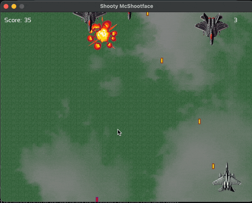

# Shooty McShootface

C++ 20 vertical shooter, built using [SFML](https://www.sfml-dev.org) and using the STL.

## C++ Version Compatibility

The game utilizes features from C++20. If you wish to compile the project using earlier versions of C++ (like C++14 or C++11), you will need to make some adjustments.

C++ 14 Features:
- `std::make_unique` -- Replace with `new` if downgrading.
- `constexpr functions` Remove or modify as needed.

C++ 20 Features:
- `std::invocable` (concepts) -- Used in `ProjectileCollisionSystem` to enable template implementation within the .cpp file. To downgrade, replace this with a header or .inl file implementation.

## Code Highlights:

- **Memory Management**: Memory Management: A deliberate mixture of smart and raw pointers is used, with RAII (Resource Acquisition Is Initialization) principles in mind. Raw pointers are chosen in performance-critical areas like the object pool for manual memory control, and in key systems like World to improve compilation times by leveraging forward declarations. Smart pointers are used in areas like Game and StateHandler for automatic memory management and ownership clarity.
- **Template-Based Object Pool**: Efficient management of game objects. 
- **Visual Effects**: Parallax scrolling for ground and clouds.
- **Animation**: Sprite sheet for frame-based animations.
- **Entity System**: A basic system to manage game entities.
- **ECS-Inspired Architecture**: `Systems inspired by Entity-Component-System (ECS) architecture, although not fully component-based.
- **StateHandler**: Manages the creation and destruction of World instances to ensure memory usage is correctly managed and cleaned up. 
- **Controllers**: Used for spawning and ticking entities, with logic gradually being migrated into systems.

