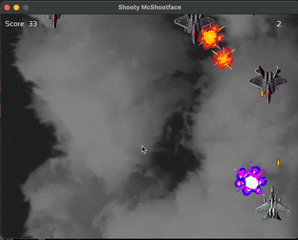

# Shooty McShootface

C++ 20 vertical shooter, built using [SFML](https://www.sfml-dev.org) and using the STL.

_Note: If you wish to compile against C++11, adjust the below features accordingly:_

C++ 20 Requirements:
- `std::invocable` (using C++20 concepts) -- Used in ProjectileCollisionSystem to enable template implementation within the .cpp file. To downgrade, replace this with a header or .inl file implementation.

C++ 14 Requirements:
- `std::make_unique` -- Replace with `new` if downgrading.
- `constexpr functions` Remove or modify as needed.

Code Highlights:
 
- **Memory Management**: A deliberate mixture of smart and raw pointers is used, with RAII (Resource Acquisition Is Initialization) principles in mind. Raw pointers are used in performance-critical areas like the object pool, while smart pointers are used in areas like Game and StateHandler for automatic memory management.
- **Template-Based Object Pool**: Efficient managedment of game objects. 
- **Visual Effects**: Parallax scrolling for ground and clouds.
- **Animation**: Sprite sheet for frame-based animations.
- **Entity System**: A basic system to manage game entities.
- **ECS-Inspired Architecture**: Systems inspired by Entity-Component-System (ECS) architecture, although not fully component-based.
- **Controllers**: Used for spawning and ticking entities, with tick logic gradually being migrated into systems.

